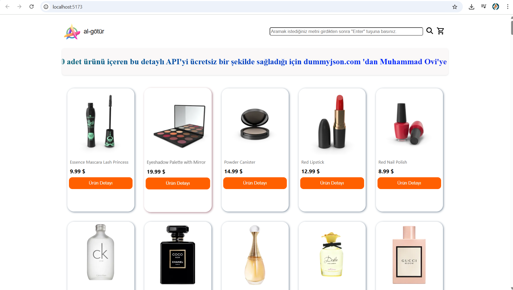
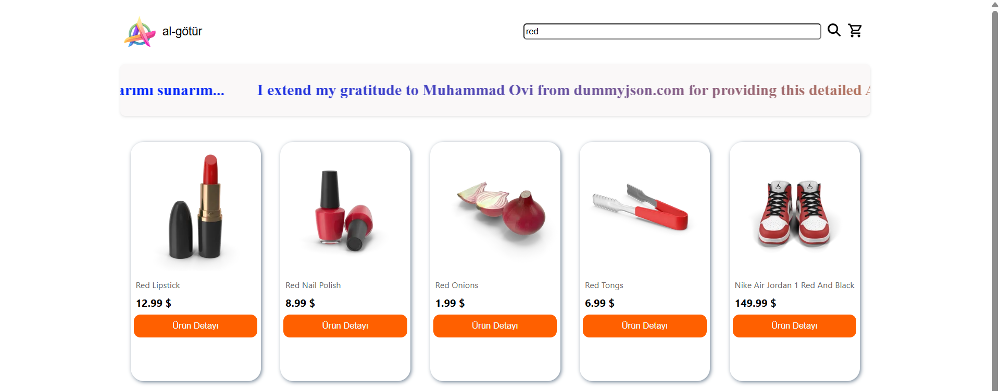

# React Redux E-Commerce Store

[](README.tr.md)

This is a responsive e-commerce front-end application built with React and Redux Toolkit. It allows users to browse products, search for specific items, view product details, and manage a shopping cart. The project utilizes the DummyJSON API to fetch product data.

## Features & Screenshots

**1. Main Page & Product Listing**


**2. Product Search**


**3. Product Details Page**


**4. Shopping Cart Modal**


**5. Persistent Shopping Cart (Local Storage)**


### Core Features:
-   **Product Listing & Dynamic Search**
-   **Detailed Product View**
-   **State Management with Redux Toolkit**
-   **Shopping Cart:** Add, remove, and update item quantities.
-   **Local Storage Persistence:** Cart data is saved between sessions.
-   **Loading Indicator & Responsive Design**

## Tech Stack

-   **Frontend:** React
--   **State Management:** Redux Toolkit
-   **Routing:** React Router DOM
-   **UI Components:** Material-UI (MUI)
-   **HTTP Client:** Axios

## Installation and Setup

To run this project locally, follow these steps:

1.  **Clone the repository:**
    ```bash
    git clone https://github.com/senin-kullanici-adin/react-redux-ecommerce-store.git
    ```

2.  **Navigate to the project directory:**
    ```bash
    cd react-redux-ecommerce-store
    ```

3.  **Install the dependencies:**
    ```bash
    npm install
    ```

4.  **Run the development server:**
    ```bash
    npm run dev
    ```
    The application will be available at `http://localhost:5173`.

## API Credit

A special thank you to **Muhammad Ovi** and the **[DummyJSON API](https://dummyjson.com/)** for providing an excellent and free resource for developers.