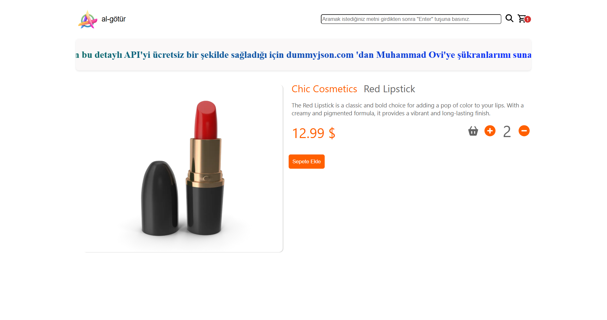

# React Redux E-ticaret Mağazası

[](README.md)

React ve Redux Toolkit ile geliştirilmiş, duyarlı bir e-ticaret arayüz uygulamasıdır. Kullanıcıların ürünlere göz atmasına, ürün aramasına, detayları görüntülemesine ve alışveriş sepetini yönetmesine olanak tanır. Proje, ürün verilerini çekmek için DummyJSON API'sini kullanmaktadır.

## Özellikler ve Ekran Görüntüleri

**1. Ana Sayfa ve Ürün Listeleme**


**2. Ürün Arama**


**3. Ürün Detay Sayfası**


**4. Alışveriş Sepeti Modalı**


**5. Kalıcı Alışveriş Sepeti (Local Storage)**


### Temel Özellikler:
-   **Ürün Listeleme ve Dinamik Arama**
-   **Detaylı Ürün Görünümü**
-   **Redux Toolkit ile Durum Yönetimi**
-   **Alışveriş Sepeti:** Ekleme, çıkarma ve miktar güncelleme.
-   **Local Storage Kalıcılığı:** Sepet verileri oturumlar arasında saklanır.
-   **Yükleme Göstergesi ve Duyarlı Tasarım**

## Kullanılan Teknolojiler

-   **Arayüz:** React
-   **Durum Yönetimi:** Redux Toolkit
-   **Yönlendirme (Routing):** React Router DOM
-   **UI Bileşenleri:** Material-UI (MUI)
-   **HTTP İstemcisi:** Axios

## Kurulum ve Çalıştırma

1.  **Projeyi klonlayın:**
    ```bash
    git clone https://github.com/senin-kullanici-adin/react-redux-ecommerce-store.git
    ```

2.  **Proje dizinine gidin:**
    ```bash
    cd react-redux-ecommerce-store
    ```

3.  **Gerekli paketleri yükleyin:**
    ```bash
    npm install
    ```

4.  **Geliştirme sunucusunu başlatın:**
    ```bash
    npm run dev
    ```
    Uygulama `http://localhost:5173` adresinde çalışacaktır.

## API Teşekkürü
Geliştiriciler için bu mükemmel ve ücretsiz kaynağı sağladığı için **Muhammad Ovi**'ye ve **[DummyJSON API](https://dummyjson.com/)**'sine özel teşekkürler.